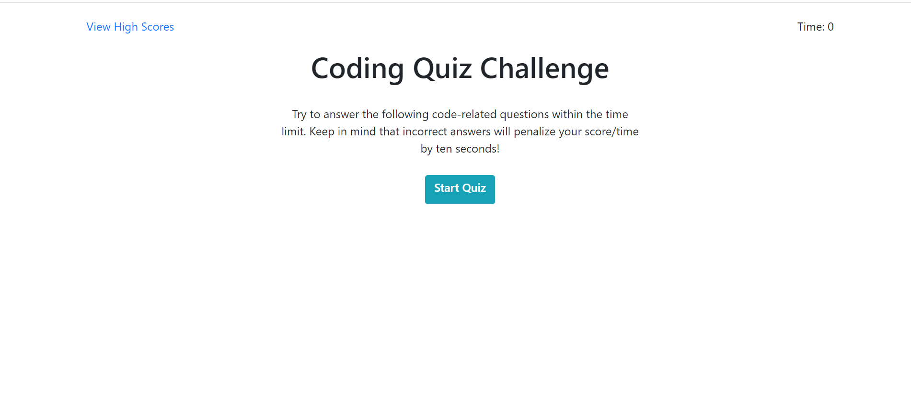

# Code Quiz
In this homework assignment we were asked to build a code quiz with multiple choice questions. When answering the questions it should respond right or wrong, and if wrong, deduct 10 seconds from the timer. If the timer runs out or you answer all the questions the game should end and give you an option to enter in your initials and save your end score. We were asked to display all the scores that were saved onto a scores page utilizing local storage. We were not given any documents to begin with, making this assignment specially challenging since we had to use a lot of the skills we have learned over a 4 week period of time, a lot of them being ones we haven't used since learning them in the beginning of class.

## Deployed Project

[Code Quiz](https://tristinbarnett.github.io/CodeQuiz/)

